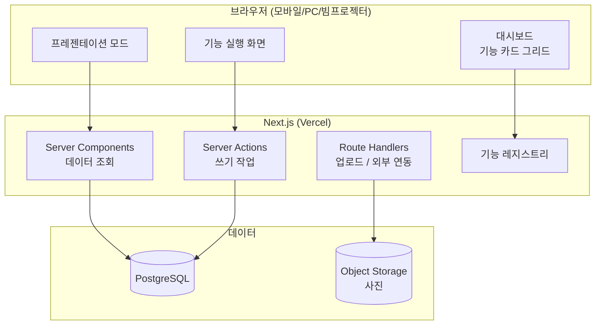
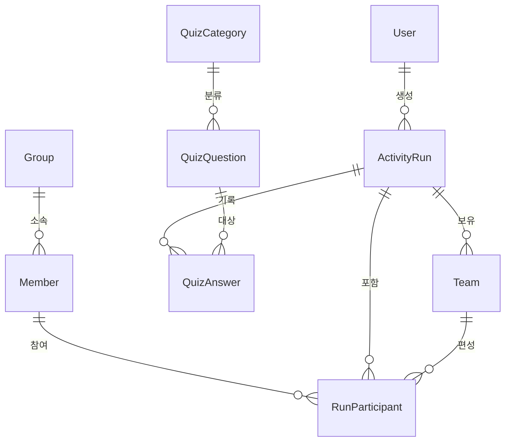

# 교회 기능 플랫폼 — 1차 시스템 설계서

> 작성일: 2026-07-25 · 상태: 설계안(v0.1, 검토 대기)

---

## 1. 목표와 핵심 요구사항

교회 모임에서 사용하는 **여러 진행용 기능(성경퀴즈, 사다리타기, 간증 순서 진행 등)을 하나의 대시보드에서 골라 실행**하는 사내 툴 성격의 웹앱.

| # | 요구사항 | 설계에 미치는 영향 |
|---|---------|-----------------|
| R1 | 대시보드에서 원하는 기능을 선택해 실행 | **기능 레지스트리(플러그인) 구조**가 아키텍처의 중심 |
| R2 | 기능을 계속 추가 | 기능 추가 시 기존 코드 수정 없이 폴더 하나 추가로 끝나야 함 |
| R3 | 형제/자매 명단 등록 후 여러 기능에서 재사용 | `Member`를 **공용 도메인**으로 분리 (기능별 중복 등록 금지) |
| R4 | 모바일 정상 동작 (반응형) | 모바일 퍼스트. 사이드바 → 모바일에선 드로어/하단탭 |
| R5 | 사용자 사진 첨부 | 파일은 오브젝트 스토리지, DB엔 URL만. 업로드 전 클라이언트 리사이즈 |
| R6 | 진행 결과(순서, 점수) 기록 | 기능 공통 `ActivityRun` 테이블로 이력 보존 |
| R7 | (암시) 빔프로젝터/큰 화면 진행 | **프레젠테이션 모드**를 별도 레이아웃으로 설계 |

---

## 2. 기술 스택 결정

### 결론

| 레이어 | 선택 | 이유 |
|-------|------|-----|
| 언어 | **TypeScript** | 프론트/백엔드 한 언어. 기능이 계속 늘어날 때 타입이 리팩터링 안전망이 됨 |
| 프레임워크 | **Next.js 15 (App Router)** | 화면 + API를 한 프로젝트에서. Server Actions로 별도 백엔드 서버 불필요 |
| UI | **Tailwind CSS + shadcn/ui** | 첨부 이미지 같은 카드형 대시보드를 빠르게. 반응형 유틸리티가 강점 |
| 차트 | **Recharts** | 대시보드 통계 위젯 |
| 애니메이션 | **Framer Motion + Canvas** | 사다리타기 줄 타는 애니메이션은 Canvas로 직접 그림 |
| ORM | **Prisma** | 스키마 파일 하나로 마이그레이션 관리. 기능 추가 = 모델 추가 |
| DB | **PostgreSQL** (Supabase 또는 Neon 무료 티어) | 아래 참조 |
| 파일 저장 | **Supabase Storage** (또는 Cloudflare R2) | 사진 업로드. DB에 바이너리 저장 안 함 |
| 인증 | **Auth.js (NextAuth) v5** — Credentials + 향후 카카오 | 관리자/인도자 로그인. 참가자는 방 코드로 무로그인 참여 |
| 배포 | **Vercel** (무료) | Next.js 네이티브. 깃 푸시 = 배포 |
| 검증 | **Zod** | 폼/API 입력 검증 스키마를 프론트·백엔드 공유 |

### DB를 왜 PostgreSQL인가 (SQLite 대신)

- SQLite가 규모상으로는 충분하지만, **Vercel 같은 서버리스 환경은 파일시스템이 휘발성**이라 SQLite를 쓸 수 없습니다.
- Prisma로 `sqlite`(로컬) / `postgres`(운영)를 병행하면 JSON 타입·enum 지원 차이 때문에 스키마가 갈라집니다 → 개발/운영 동일하게 Postgres 하나로 통일.
- Supabase 무료 티어 한 프로젝트로 **DB + 스토리지 + (향후) 실시간**까지 커버되어 부품 수가 줄어듭니다.

> **대안 시나리오:** 교회 와이파이가 불안정해 인터넷 없이도 돌려야 한다면 → SQLite + 노트북 로컬 실행(LAN 접속) 구성으로 바꿉니다. 이건 §13에서 확인이 필요한 항목입니다.

### 채택하지 않은 후보

- **Python + FastAPI/Django**: 서버는 견고하지만, 사다리타기 애니메이션·실시간 퀴즈 같은 인터랙티브 화면 때문에 어차피 React가 필요 → 두 언어 관리 비용만 늘어남.
- **Firebase/Firestore**: 이 앱은 "누가 몇 번 순서" 같은 관계형 질의가 많아 SQL이 유리.
- **순수 정적 사이트 + localStorage**: 명단·사진·이력 공유가 불가능.

---

## 3. 아키텍처 개요



핵심 원칙 3가지:

1. **기능은 서로를 모른다.** 기능끼리 직접 import 금지. 공용 도메인(`Member`, `Group`, `ActivityRun`)과 공용 UI만 공유.
2. **모든 실행은 기록된다.** 어떤 기능이든 실행하면 `ActivityRun` 한 건이 남고, 기능별 상세는 `configJson` / `resultJson`에 저장.
3. **화면은 두 종류다.** 조작용(모바일 손안) / 표출용(큰 화면). 같은 데이터, 다른 레이아웃.

---

## 4. 기능 모듈(플러그인) 구조 — 이 설계의 핵심

기능 하나 = 폴더 하나. 폴더 안에 매니페스트를 두고, 레지스트리가 자동 수집해 대시보드 카드를 렌더합니다.

```
src/features/
├── registry.ts              ← 모든 매니페스트를 모으는 유일한 지점
├── types.ts                 ← FeatureManifest 타입 정의
├── bible-quiz/
│   ├── manifest.ts
│   ├── page.tsx             ← /f/bible-quiz
│   ├── present/page.tsx     ← /f/bible-quiz/present (빔프로젝터용)
│   ├── actions.ts           ← Server Actions
│   └── components/
├── ladder/
│   ├── manifest.ts
│   ├── page.tsx
│   └── components/LadderCanvas.tsx
└── testimony-order/
    ├── manifest.ts
    └── page.tsx
```

```ts
// src/features/types.ts
export type FeatureManifest = {
  slug: string;                 // URL 및 DB 키. 예: "bible-quiz"
  title: string;                // "성경퀴즈"
  description: string;          // 카드에 표시될 한 줄 설명
  icon: LucideIcon;
  category: "게임" | "진행" | "관리" | "기타";
  accent: string;               // 카드 그라디언트 색 (참고 이미지 톤)
  minRole: Role;                // 실행 가능 최소 권한
  usesMembers: boolean;         // 명단 선택 UI가 필요한 기능인지
  hasPresentMode: boolean;      // 큰 화면 모드 제공 여부
};
```

```ts
// src/features/registry.ts
import bibleQuiz from "./bible-quiz/manifest";
import ladder from "./ladder/manifest";
import testimonyOrder from "./testimony-order/manifest";

export const FEATURES = [bibleQuiz, ladder, testimonyOrder] as const;
export const featureBySlug = (slug: string) =>
  FEATURES.find((f) => f.slug === slug);
```

**기능 추가 절차 (이게 짧아야 설계가 성공한 것):**

1. `src/features/<slug>/` 폴더 생성 + `manifest.ts` 작성
2. `registry.ts`에 한 줄 추가
3. 필요하면 Prisma 모델 추가 후 마이그레이션
   → 대시보드 카드·라우팅·권한 체크는 자동으로 붙습니다.

DB의 `Feature` 테이블은 **매니페스트를 덮어쓰는 운영 설정**(노출 on/off, 카드 순서, 기능별 옵션)만 담당합니다. 코드가 원본, DB가 오버라이드.

---

## 5. 데이터 모델



### Prisma 스키마 초안

```prisma
// ---------- 인증 / 권한 ----------
enum Role { ADMIN LEADER MEMBER }

model User {
  id           String  @id @default(cuid())
  loginId      String  @unique          // 이메일 대신 아이디 로그인 허용
  name         String
  passwordHash String
  role         Role    @default(LEADER)
  createdAt    DateTime @default(now())
  runs         ActivityRun[]
}

// ---------- 공용 도메인 ----------
enum Gender { BROTHER SISTER }          // 형제 / 자매

model Group {                            // 목장, 부서, 조
  id      String   @id @default(cuid())
  name    String   @unique
  sortOrder Int    @default(0)
  members Member[]
}

model Member {
  id        String   @id @default(cuid())
  name      String
  gender    Gender?
  photoUrl  String?                      // 스토리지 public URL
  phone     String?
  birthday  DateTime?
  memo      String?
  isActive  Boolean  @default(true)      // 삭제 대신 비활성 (이력 보존)
  groupId   String?
  group     Group?   @relation(fields: [groupId], references: [id])
  createdAt DateTime @default(now())
  participations RunParticipant[]

  @@index([isActive, name])
}

// ---------- 기능 공통 실행 이력 ----------
model Feature {                          // 매니페스트 오버라이드
  slug       String  @id
  isEnabled  Boolean @default(true)
  sortOrder  Int     @default(0)
  config     Json    @default("{}")
}

model ActivityRun {
  id           String   @id @default(cuid())
  featureSlug  String                    // "ladder" | "bible-quiz" | ...
  title        String?                   // "7월 청년부 간증 순서"
  roomCode     String?  @unique          // 참가자 모바일 참여용 6자리 코드
  status       String   @default("READY") // READY | RUNNING | DONE
  config       Json     @default("{}")   // 기능별 설정 스냅샷
  result       Json     @default("{}")   // 기능별 결과 스냅샷
  createdById  String?
  createdBy    User?    @relation(fields: [createdById], references: [id])
  startedAt    DateTime @default(now())
  endedAt      DateTime?
  participants RunParticipant[]
  teams        Team[]
  answers      QuizAnswer[]

  @@index([featureSlug, startedAt])
}

model Team {
  id       String @id @default(cuid())
  runId    String
  run      ActivityRun @relation(fields: [runId], references: [id], onDelete: Cascade)
  name     String
  color    String?
  score    Int    @default(0)
  members  RunParticipant[]
}

model RunParticipant {
  id        String @id @default(cuid())
  runId     String
  run       ActivityRun @relation(fields: [runId], references: [id], onDelete: Cascade)
  memberId  String?
  member    Member? @relation(fields: [memberId], references: [id])
  guestName String?                      // 명단에 없는 즉석 참가자
  orderNo   Int?                          // 사다리/추첨 결과 순서
  resultLabel String?                     // "간증 1번", "당첨" 등
  teamId    String?
  team      Team?   @relation(fields: [teamId], references: [id])
  score     Int     @default(0)

  @@unique([runId, memberId])
}

// ---------- 성경퀴즈 ----------
enum QuizType { OX MULTIPLE SHORT }

model QuizCategory {
  id        String @id @default(cuid())
  name      String @unique               // "신약", "인물", "구속사" 등
  questions QuizQuestion[]
}

model QuizQuestion {
  id          String   @id @default(cuid())
  categoryId  String?
  category    QuizCategory? @relation(fields: [categoryId], references: [id])
  type        QuizType
  question    String
  choices     Json     @default("[]")    // MULTIPLE일 때 보기 배열
  answer      String                     // OX: "O"/"X", MULTIPLE: 인덱스, SHORT: 정답문자열
  explanation String?
  reference   String?                    // "요한복음 3:16"
  difficulty  Int      @default(1)       // 1~3
  imageUrl    String?
  isActive    Boolean  @default(true)
  answers     QuizAnswer[]
}

model QuizAnswer {
  id         String @id @default(cuid())
  runId      String
  run        ActivityRun @relation(fields: [runId], references: [id], onDelete: Cascade)
  questionId String
  question   QuizQuestion @relation(fields: [questionId], references: [id])
  participantId String?
  given      String?
  isCorrect  Boolean
  elapsedMs  Int?
  answeredAt DateTime @default(now())
}
```

**설계 의도 메모**

- 새 기능 대부분은 **모델 추가 없이** `ActivityRun.config/result`만으로 구현됩니다(사다리타기, 랜덤 추첨, 조 편성 등). 퀴즈처럼 재사용 자산(문제 은행)이 있는 기능만 전용 테이블을 갖습니다.
- `Member`는 삭제하지 않고 `isActive=false` — 지난 간증 순서 기록이 깨지지 않게.
- `roomCode`는 참가자가 로그인 없이 자기 폰으로 참여하는 통로(2단계 기능).

---

## 6. 화면 구성 (IA)

```
/                         대시보드 — 기능 카드 그리드 + 최근 진행 이력 + 통계 위젯
/members                  성도 관리 — 목록/검색/사진 업로드/그룹 배정
/members/[id]             성도 상세 (참여 이력)
/groups                   그룹(목장·부서) 관리
/f/[slug]                 기능 실행 화면        ← 레지스트리 기반 동적 라우팅
/f/[slug]/present         프레젠테이션 모드 (큰 화면, 상단바 없음)
/f/bible-quiz/questions   퀴즈 문제 은행 관리 (CSV 일괄 등록 포함)
/history                  전체 진행 이력
/history/[runId]          실행 결과 상세
/join/[roomCode]          참가자 모바일 참여 (2단계)
/settings                 기능 on/off, 카드 순서, 계정 관리
/login
```

### 대시보드 (첨부 이미지 기준 각색)

- 좌측 다크 사이드바(로고 · 프로필 · 메뉴) — **`md` 이상에서만 고정 표시**, 모바일은 햄버거 드로어
- 메인: 기능 카드 그리드 `grid-cols-1 sm:grid-cols-2 xl:grid-cols-3`
- 상단 위젯: 총 성도 수 / 이번 달 진행 횟수 / 최근 실행 기능 (참고 이미지의 도넛·바 차트 톤 유지)
- 하단: 최근 진행 이력 테이블 (모바일에선 카드 리스트로 전환)

### 기능별 화면 흐름

**사다리타기 / 간증 순서**
```
참가자 선택(명단 체크 + 게스트 추가)
  → 결과 슬롯 설정(순서 1~N 또는 커스텀 라벨)
  → Canvas 사다리 애니메이션
  → 순서 확정 (ActivityRun 저장)
  → [간증 진행 모드] 현재 발표자 사진·이름 대형 표시 + 타이머 + 다음 사람
```

**성경퀴즈**
```
문제 세트 선택(카테고리·난이도·문항 수) + 개인전/팀전
  → 진행 화면(문제 1개씩, 타이머, 정답 공개, 해설)
  → 점수판
  → 결과 저장
```

---

## 7. 반응형 & 프레젠테이션 모드

| 브레이크포인트 | 레이아웃 |
|--------------|---------|
| `< 640px` | 단일 컬럼, 사이드바 드로어, 하단 고정 액션바(주요 버튼), 터치 타겟 44px 이상 |
| `640–1024px` | 2컬럼 카드, 아이콘 전용 사이드바 |
| `> 1024px` | 첨부 이미지 형태의 풀 대시보드 |
| 프레젠테이션 | 별도 라우트 그룹 `(present)`으로 레이아웃 분리. `clamp()` 기반 초대형 타이포, 다크 배경, UI 크롬 제거 |

- 진행자 폰(조작) ↔ 빔프로젝터(표출) 분리 운용은 2단계에서 실시간 동기화로 연결합니다. 1단계는 한 기기에서 표출 화면을 띄우고 조작.
- `dvh` 단위 사용(모바일 브라우저 주소창 대응), `env(safe-area-inset-*)` 적용.

---

## 8. 사진 업로드 파이프라인

```
파일 선택 (input capture="user" — 폰에서 바로 촬영 가능)
  → 브라우저 Canvas로 정사각 크롭 + 512px 리사이즈 + WebP 변환  (용량 90%↓)
  → Route Handler에서 서명 URL 발급
  → 스토리지 직접 업로드
  → Member.photoUrl 갱신
```

- 검증: 이미지 MIME 화이트리스트, 리사이즈 후 300KB 상한.
- 사진 없는 성도는 **이름 이니셜 아바타**(이름 해시 → 색상) 자동 생성.
- 교회 명단 = 개인정보. 목록·사진은 로그인 사용자만 접근, 스토리지 버킷은 비공개 + 서명 URL 권장.

---

## 9. 인증 / 권한

| 역할 | 권한 |
|-----|-----|
| `ADMIN` | 전체. 계정·기능 on/off·설정 |
| `LEADER` | 기능 실행, 성도 등록/수정, 퀴즈 문제 관리 |
| `MEMBER` | 조회 + 참여 |
| 게스트 | `roomCode`로 해당 세션에만 참여(2단계) |

- 1단계는 **아이디/비밀번호(Credentials)** 로 최소 구현. 교회 규모상 계정은 관리자가 직접 발급.
- 향후 카카오 로그인 추가는 Auth.js provider 한 줄 추가로 가능.
- 미들웨어에서 `/f/*`, `/members`, `/settings` 보호.

---

## 10. 배포 & 환경

| 환경 | 구성 |
|-----|------|
| 로컬 개발 | `npm run dev` + Supabase 개발 프로젝트 |
| 운영 | Vercel(Hobby, 무료) + Supabase(무료) → 예상 비용 **0원** |
| 도메인 | `xxx.vercel.app` 로 시작, 필요시 커스텀 도메인 연결 |
| 백업 | 주 1회 `pg_dump` (또는 Supabase 자동 백업) |

**필요 사전 준비 (현재 PC에 없음):**
- Node.js 20 LTS 이상 설치 — https://nodejs.org
- GitHub 계정 + 이 프로젝트 git 저장소 초기화 (현재 git 저장소 아님)
- Supabase 계정, Vercel 계정

---

## 11. 폴더 구조

```
D:\myProject
├── docs/ARCHITECTURE.md          ← 이 문서
├── prisma/
│   ├── schema.prisma
│   └── seed.ts                   ← 샘플 성도 · 퀴즈 문제
├── public/
├── src/
│   ├── app/
│   │   ├── (dashboard)/          ← 사이드바 레이아웃
│   │   │   ├── page.tsx          ← 대시보드
│   │   │   ├── members/
│   │   │   ├── history/
│   │   │   ├── settings/
│   │   │   └── f/[slug]/page.tsx ← 기능 동적 라우팅
│   │   ├── (present)/            ← 프레젠테이션 레이아웃
│   │   ├── (auth)/login/
│   │   └── api/upload/route.ts
│   ├── features/                 ← §4 기능 모듈
│   ├── components/
│   │   ├── ui/                   ← shadcn/ui
│   │   ├── layout/               ← Sidebar, MobileDrawer, TopBar
│   │   └── domain/               ← MemberPicker, MemberAvatar, ScoreBoard
│   ├── lib/
│   │   ├── db.ts  auth.ts  storage.ts  utils.ts
│   │   └── validators/           ← Zod 스키마
│   └── types/
├── .env.local
└── package.json
```

`components/domain/MemberPicker` 같은 공용 컴포넌트가 신규 기능 개발 시간을 좌우합니다 — 여기에 먼저 투자합니다.

---

## 12. 개발 로드맵

| 단계 | 범위 | 산출물 |
|-----|------|-------|
| **0. 골격** | Next.js+Prisma+Auth 셋업, 다크 사이드바 레이아웃, 반응형 셸, 대시보드 카드 그리드(더미) | 로그인 후 빈 대시보드 |
| **1. 공용 도메인** | 성도 CRUD, 사진 업로드, 그룹, `MemberPicker` | 명단 관리 완성 |
| **2. 사다리타기 + 간증 진행** | Canvas 애니메이션, 순서 확정, 진행 모드(타이머·현재 발표자) | 첫 실사용 가능 기능 |
| **3. 성경퀴즈** | 문제 은행(CSV 등록), 개인/팀 세션, 점수판, 프레젠테이션 모드 | 두 번째 기능 |
| **4. 이력 & 통계** | `/history`, 대시보드 차트 위젯 | 참고 이미지 수준 대시보드 |
| **5. 실시간 참여** | `roomCode` 참여, Supabase Realtime으로 진행자↔참가자 동기화 | 폰으로 퀴즈 응답 |
| **6+. 기능 확장** | 출석 체크, 조 편성, 랜덤 추첨, 찬양 순서, 기도 제목, 심방 일정… | 모듈 추가 |

각 단계는 독립 배포 가능하며, 2단계만 끝나도 실제 모임에서 쓸 수 있습니다.

---

## 13. 확정된 결정 사항 (2026-07-25)

| 항목 | 결정 | 결과 |
|-----|------|-----|
| 실행 환경 | **클라우드 배포** (Vercel + Supabase) | §2 스택 그대로 확정. PostgreSQL 단일 DB, 로컬 개발도 Supabase 개발 프로젝트 사용 |
| 진행 방식 | **진행자 1명이 조작** | 실시간 동기화는 5단계로 유보. `ActivityRun.roomCode` 컬럼은 미리 남겨두되 미사용 |
| 계정 범위 | 관리자/인도자 로그인, 나머지는 표출 화면 시청 | Credentials 로그인 + `ADMIN`/`LEADER` 역할로 1단계 구현. `MEMBER`·게스트는 스키마만 준비 |
| 첫 구현 범위 | **0단계 — 대시보드 골격** | 로그인 · 반응형 셸 · 기능 카드 그리드 · 성도 관리(1단계 일부)까지. 실제 기능(사다리/퀴즈)은 화면 확인 후 결정 |

### 0단계 상세 작업 목록

1. Next.js 15 + TypeScript + Tailwind + shadcn/ui 프로젝트 생성
2. Prisma 스키마 적용 (§5 전체) + Supabase 연결 + seed 데이터
3. Auth.js Credentials 로그인 + 미들웨어 라우트 보호
4. 반응형 셸: 데스크톱 다크 사이드바 / 모바일 드로어 + 하단 액션바
5. 기능 레지스트리(§4) 골격 + 매니페스트 기반 대시보드 카드 그리드 (사다리타기·성경퀴즈는 "준비 중" 카드로 자리만)
6. 통계 위젯 + 최근 진행 이력 영역 (더미 → 실데이터)
7. 성도 관리: 목록/검색/등록/사진 업로드/그룹 배정
8. Vercel 첫 배포 → 폰에서 실제 확인

### 사전 준비 상태 (2026-07-25 확인)

| 항목 | 상태 |
|-----|------|
| Node.js 20 LTS | ❌ 미설치 (winget으로 설치 가능) |
| git | ✅ 2.45.1 설치됨 (단, `D:\myProject`는 아직 저장소 아님) |
| GitHub 계정 / 저장소 | 확인 필요 |
| Supabase 계정 | 확인 필요 |
| Vercel 계정 | 확인 필요 |
